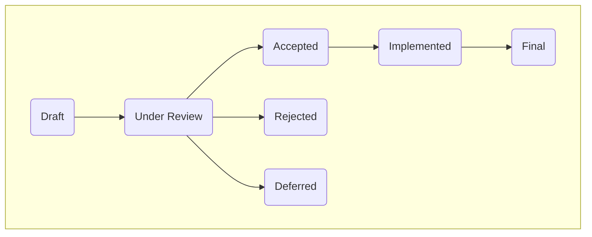
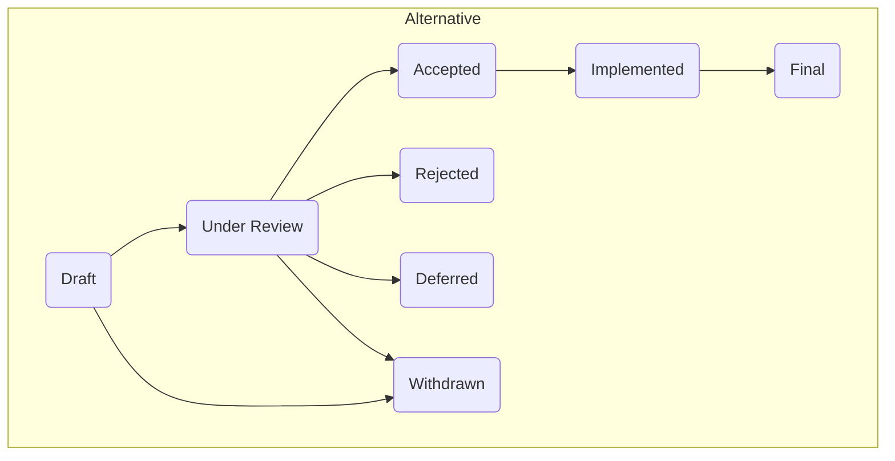

# RFC 0001: RFC Status Lifecycle

- Author(s): Taylor Steinberg <taylor.steinberg@posit.co>
- Status: Under Review

## Summary

<!-- Provide a concise summary of the proposal. What problem does it solve, and what is the proposed solution? -->

This document proposes an RFC Status Lifecycle.

## Motivation

<!-- Explain the motivation behind the proposal. Why is this change or feature needed? What are the goals it aims to achieve? -->

A documented status workflow provides a consistent implementation process across RFCS.

## Detailed Design

<!-- Provide detailed information about the proposed changes. This may include code snippets, architectural diagrams, or any other relevant details. -->

- Draft: The proposal is in the early stages of development and is subject to changes.
- Under Review: The proposal has been submitted for community or team review. Please create a GitHub pull request for discussion.
- Accepted: The community or relevant stakeholders have reviewed and accepted the proposal.
- Rejected: The community or relevant stakeholders have reviewed and accepted the proposal.
- Deferred: The proposal is not rejected outright but set aside for future consideration. The proposal may be reconsidered later when conditions are more favorable.
- Implemented: The proposal has been successfully implemented and integrated into the project.
- Final: The proposal has completed the entire lifecycle, including implementation and any necessary revisions.

## Drawbacks

<!-- Highlight potential downsides or trade-offs associated with the proposal. Are there any risks or negative impacts that need to be considered? -->

## Alternatives

<!-- Discuss alternative approaches that were considered but not chosen. Provide reasoning for why the proposed solution is preferred. -->

A *Withdrawn* status may be added to convey pre-committee decisions.

> Withdrawn: The author or proposer has decided to withdraw the proposal for various reasons. It won't be further pursued.

## Implementation Details

<!-- If applicable, outline specific implementation details. This could include changes to existing code, new dependencies, or other technical considerations. -->

N/A

## Open Questions

<!-- List any questions or concerns that are still open and need further discussion. This section can be updated as discussions progress. -->

None

## References

<!-- Provide links to related issues, discussions, or external resources that are relevant to this proposal. -->

1. OpenAI. (2024). ChatGPT [Large language model]. https://chat.openai.com/share/3e6b0542-c081-48bf-a481-f1ee10dd9611
